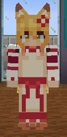
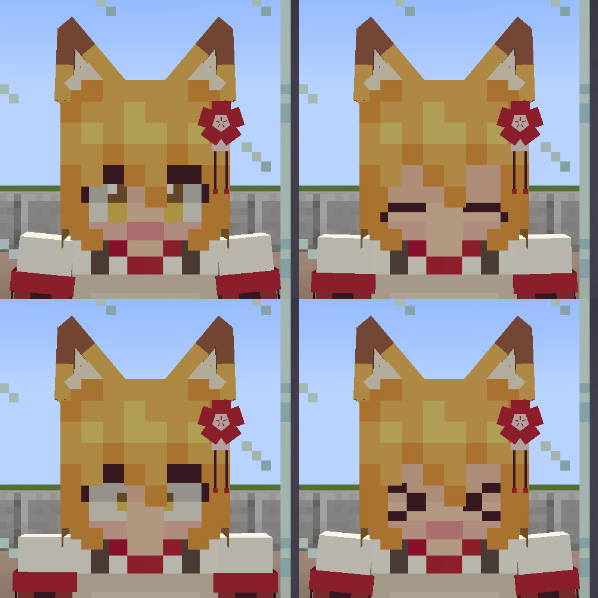
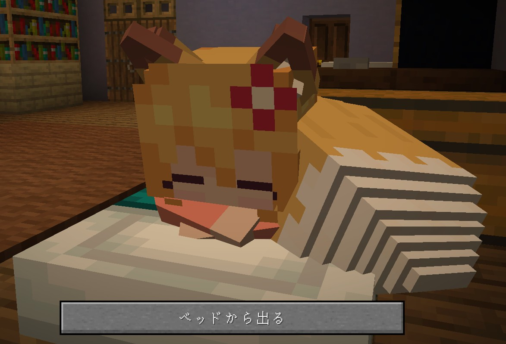
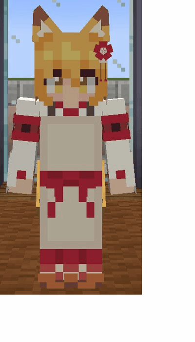
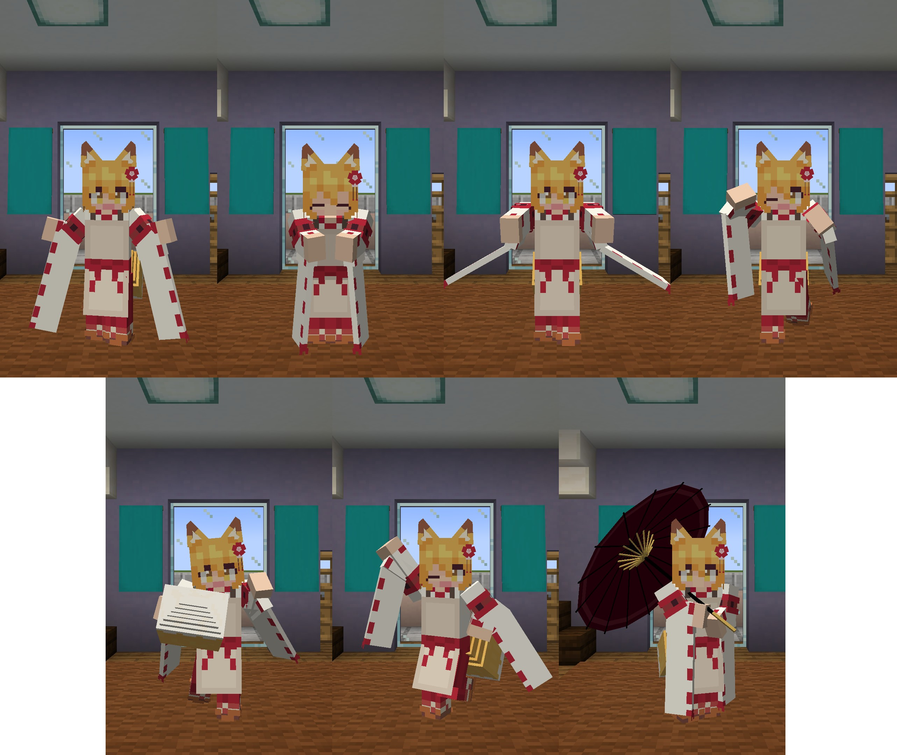
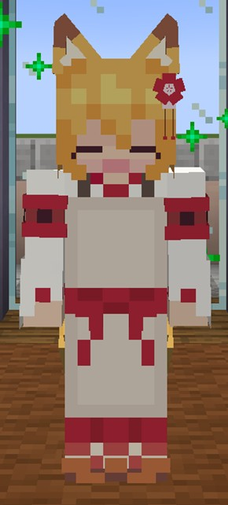
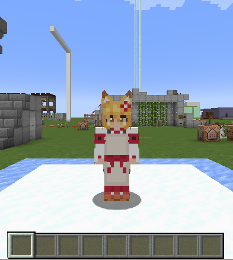

# Information

This is the download page for **Senko**.


Click [here](https://github.com/Gakuto1112/SenkoSan/tree/Shiro) for the download page for **Shiro**.


Click [here](https://github.com/Gakuto1112/SenkoSan/tree/Suzu) for the download page for **Suzu**.


Click [here](https://github.com/Gakuto1112/Sora) for the download page for **Sora**.

---

# Senko-san (仙狐さん)
This is "Senko-san (仙狐さん)", the avatar for [Figura](https://modrinth.com/mod/figura), the skin mod for [Minecraft](https://www.minecraft.net/en-us), which imitates the character who appears in the TV anime "Sewayaki Kitsune no Senko-san" series and the original manga series.

Target Figura versions: [0.1.1](https://modrinth.com/mod/figura/version/0.1.1+1.20.1-0f8b7a9)~


## Features
- Has ears and tail models.
  - Her tail sways with the player's movements.

    

  - You can jerk the ears with **X key** and wag the tail with **Z key**.

    

    

- Her ears droop and har facial expression changes depending on the player's health and satiety.

  

- Sometimes she blinks.

- Can play various animations with [the action wheel](#the-action-wheel).

  

- Can sit down with [the action wheel](#action-2-1-sitting-down).
  - Some animations can be played only when sitting down.

  

- Can change the facial expressions with the cursor keys (↑→↓←).

  

- Changes vanilla swords to [Naginatas](https://en.wikipedia.org/wiki/Naginata) (from episode 77 of the manga).
  - Holds the naginata when held in the main hand (not in the off hand).
  - Takes a defensive stance with naginata when using a shield while holding a naginata.

  

- Sleeps like a fox at bedtime (from episode 2 of the anime).
  - Takes another sleeping pose (?) when she has the darkness effect.

  

- She will sleep with you when she sleeps on a valid double bed.
  - "A valid double bed" means that two (or more) beds are adjacent to each other and facing the same direction, and neither of these beds are in use.
  - The skin of the dummy player will be your one.
  - The bed in which the dummy player sleeps is actually not in use, so other players or villagers may sleep in the bed. She will change to the normal sleeping animation in this case.
  - When you sleep in the first person with her...?

  

- Can change the costume from about 20 different costumes. You can check [the costume catalog](./costume_list.md) to know what costumes are available.

  

- Can take some poses for taking a picture.

  

- Grooms her tail and relaxes in the [kotatsu](https://en.wikipedia.org/wiki/Kotatsu) when she is left alone for a short while.

  

  

  - Don't let her alone for a long time and make her lonely.

- Can change your display name to her name.
  - Other players also need to install Figura and give enough permissions to see your display name.

  

- Changes your head block to her figures (can changes in [the settings](#action-4-3-player-head-change)).
  - [The figure on the top-left of the image](https://www.goodsmile.info/ja/product/9273/仙狐.html)
  - [The figure on the top-center of the image](https://www.geestore.com/detail/id/00000093048)
  - [The figure on the top-left of the image](https://www.amazon.co.jp/gp/product/B07XZ6754D)
  - The figure on the bottom-right of the image was made based on an illustration from the back of volume 10 of the manga.
  - [The figure on the bottom-right of the image](https://twitter.com/Kanda_omiyage/status/1627141001197531136?t=pWBnib7WuzlAD-uUdDcqIg&s=19)

  

- Gets wet when touching water/rain.
  - Shakes her body and flicks water droplets off the body when getting out of water/rain (can disable in [the settings](#action-4-4-toggle-auto-body-shaking)).

    

  - Her tail shrivels up when getting whe.

    

- Takes an umbrella if it's raining.
  - Won't get wet when taking it.
  - Won't take it when holding an item in off hand or playing an animation (of course, she gets wet in the case).
  - The umbrella open/close sound can disable in [the settings](#action-4-7-toggle-umbrella-openclose-sound).

  

- Appears foxfires (small fireballs) around her when she has the night vision effect.
  - The number of foxfires is different depends on the character.
  - They are extinguished when getting wet.
  - Using a shader pack make them look more like foxfires thanks to its bloom effects.

  

- Will be frightened and tremble when a [warden](https://minecraft.wiki/w/Warden) is nearby her (≒ she has the darkness effect).

  

  - Refuses playing animations when she is frightened.

    

## The action wheel
Figura provides the action wheel with which players can play some actions (emotes, animations, configs, and etc.). It will be shown when holding the action wheel key (default is B key). This avatar also has some actions.

### Page 1 (the standing actions)


#### Action 1-1. Smile (uyan♪)
Plays the smile animation which is played at the end of other actions. Left-click to just smile, and right-click to play with the sound and particles.



#### Action 1-2. Shaking body
Can play the body shake animation which plays when getting out of water manually.


#### Action 1-3. Cleaning
Left-click to play broom sweeping, and right-click to play wipe cleaning. The broom sweeping animation has the rare version (The rare version is from episode 4 of the anime).


#### Action 1-4. Hair cutting
She will trim your hair (from episode 9 of the anime, the skin will be your one). She also cut a little too...


#### Action 1-5. Fox jump
Dive into the snow like a fox (from episode 10 of the anime). Enough snow and space is needed to play this action.



#### Action 1-6. Tail grooming
Brushes her tail to increase the "flulity" (fluffy quality of the tail) (from episode 16.5 of the manga). This action can be played while standing of sitting.


### アクション1-7. Kotatsu
Relaxes in the Kotatsu (from episode 10 of the anime). This action won't stop due to the passage of time.


### Page 2 (the sitting actions)


#### Action 2-1. Sitting down
Sits down there. She will stand up when playing this action again. She will also stand up when moving, jumping, or sneaking while setting down.


#### Action 2-2. Tail cuddling
You will cuddle her tail (from episode 1 of the anime, the skin will be your one). This action can be played while sitting. However, it can't be played when she wears outgoing costume or armors are visible.


#### Action 2-3. Ears cuddling
You will cuddle her ears (from episode 2 of the anime, the skin will be your one). This action can be played while sitting. However, it can't be played when she wears the costume which covers her ears.


#### Action 2-4. Ear pick
Cleans your ears on her kneecap (from episode 2 of the anime, the skin will be your one). This action can be played while sitting.


#### Action 2-5. Tea time
Takes a sip of [Hojicha](https://en.wikipedia.org/wiki/Hōjicha) (from episode 6 of the anime). This action can be played while sitting.


#### Action 2-6. Massage
Takes the stiffness out of your shoulders (from episode 6 of the anime, the skin will be your one). This action can be played while sitting.


### Page 3 (the photo poses)


Poses in 7 different poses. Can be used for photo shoots. Her umbrella will be used as a prop for pose 7.


### Page 4 (avatar settings 1)


#### Action 4-1. Costume change
Changes her [costume](./costume_list.md). Scroll to select the costume and closing the action wheel to confirm. Left-click to reset to current selection, and right-clock to reset to default during selection.

#### Action 4-2. Display name change
Changes the player's display name. Scroll to select the name and closing the action wheel to confirm. Left-click to reset to current selection, and right-clock to reset to default during selection. However, **Other players also need to install Figura and give enough permissions** to see your display name.


The name option which can be set are as follows:

- &lt;Player name&gt;
- Senko
- 仙狐
- Senko_san
- 仙狐さん
- Sen
- 仙
- セン

#### Action 4-3. Player head change
Changes the model of the "player head". Scroll to select the model and closing the action wheel to confirm. Left-click to reset to current selection, and right-clock to reset to default during selection.


The model option which can be set are as follows:

- Default (the avatar's head model only)
- The figure（[reference](https://www.goodsmile.info/ja/product/9273/仙狐.html)）
- The maid figure（[reference](https://www.geestore.com/detail/id/00000093048)）
- The cheerleader figure（[reference](https://www.amazon.co.jp/gp/product/B07XZ6754D)）
- The fox hoodie figure was made based on an illustration from the back of volume 10 of the manga.
- The kimono figure（[reference](https://twitter.com/Kanda_omiyage/status/1627141001197531136?t=pWBnib7WuzlAD-uUdDcqIg&s=19)）

Your "player heads" which other players/mobs wear will be the default heads regardless of this settings.

You can get your "player head" by using the following command with cheat mode:
```
/give @p minecraft:player_head{SkullOwner: "<player_name>"} 1
```

#### Action 4-4. Toggle auto body shaking
Toggles whether [she shakes her body](#action-1-2-shaking-body) or not when getting wet.

#### Action 4-5. Toggle armors visible
Toggles whether equipped armors are visible or not. Some [costumes](./costume_list.md) will be hidden not to interfere with the armors while equips them. This setting will only affects to vanilla armors.

#### Action 4-6. Toggle foxfires visible in first person
Toggles whether foxfires are visible or not in the first person. Turn this off if you are annoyed with them when looking up.


#### Action 4-7. Toggle umbrella open/close sound
Toggles whether the umbrella open/closed sounds are played or not. Turn this off if you are annoyed with them.

### Page 5 (avatar settings 2)


#### Action 5-1. Toggle always umbrella use
Toggles whether she always use umbrella when she can use it even if it isn't raining. Can be used for photo shoots.


#### Action 5-2. Toggle frequently shown messages
Toggles whether messages which are showed frequently show or not. This setting will not affects the action wheel messages. Turn this off if you are annoyed with them.

## How to use
Figura is available in [Forge](https://files.minecraftforge.net/net/minecraftforge/forge/), [Fabric](https://fabricmc.net/), and [Quilt](https://quiltmc.org/).

1. Install the mod loader which you want to use and make the mods available.

2. Install [Figura](https://modrinth.com/mod/figura). Note the mod dependencies.

3. Go to the download page for the character which you want to download.

4. Click green "**<>Code**" button at the top of the page and "**Download ZIP**" to download the repository files (or clone this repository).

5. Extract the file if it is a zipped file.

6. Put avatar files at `<minecraft_instance_directory>/figura/avatars/`.
   - The directory will automatically generated after launching the game with Figura installed. You can also create it manually if it doesn't exist.

7. Open the Figura menu (Δ mark) from the game menu.

8. Select the avatar from the avatar list at the left of the Figura menu.

9. Sets your permission if you need.

10. Other Figura players can see your avatar after uploading your avatar to the Figura server.