Language: 　**English**　|　[日本語](./README_jp.md)

# Information
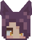
This is the branch for **Sora**.

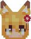
Click [here](https://github.com/Gakuto1112/SenkoSan/tree/Senko) for the branch for **Senko**.

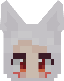
Click [here](https://github.com/Gakuto1112/SenkoSan/tree/Shiro) for the branch for **Shiro**.

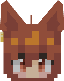
Click [here](https://github.com/Gakuto1112/SenkoSan/tree/Suzu) for the branch for **Suzu**.

# Sora (夜空)
<!-- DESCRIPTION_START -->
This is "Sora (夜空)", the avatar for [Figura](https://modrinth.com/mod/figura), the skin mod for [Minecraft](https://www.minecraft.net/en-us), which is imitated the character who appears in the TV anime "Sewayaki Kitsune no Senko-san" series and the original manga series.

Target Figura version: [0.1.5](https://modrinth.com/mod/figura/version/0.1.5b+1.21.4)
<!-- DESCRIPTION_END -->

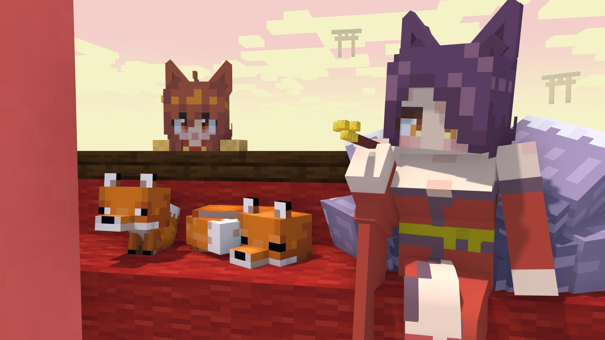

## Features
- Has ears and tail models.
  - Her tail sways with the player's movements.

    

  - You can jerk the ears with **X key** and wag the tail with **Z key**.

    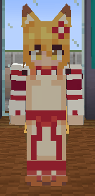

    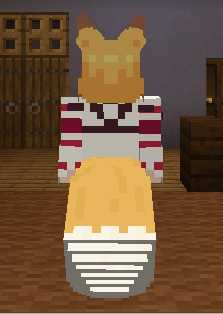

- Her ears droop and har facial expression changes depending on the player's health and satiety.

  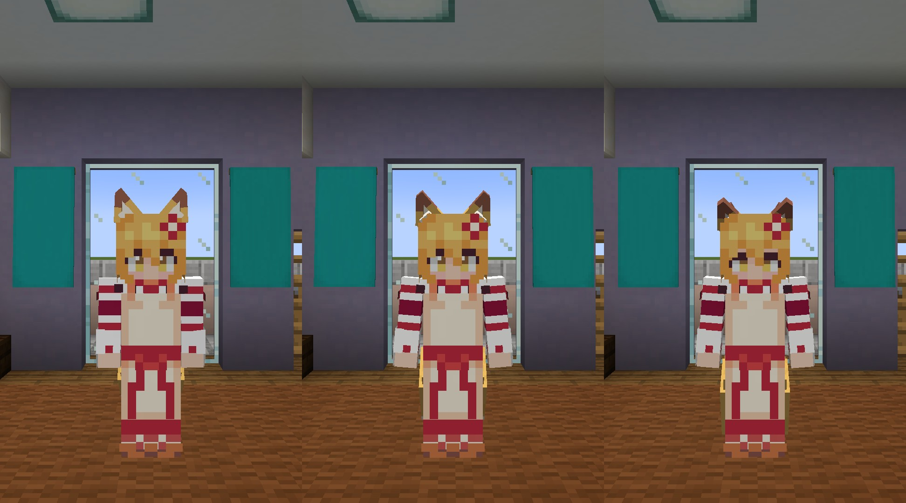

- Sometimes she blinks.

- Can sit down with [the action wheel](#the-action-wheel).

  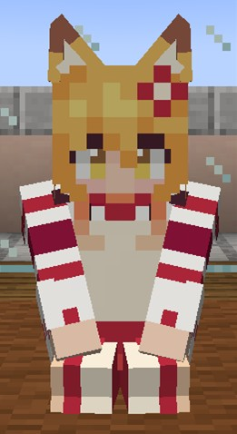

- Can change the facial expressions with the cursor keys (↑→↓←).

  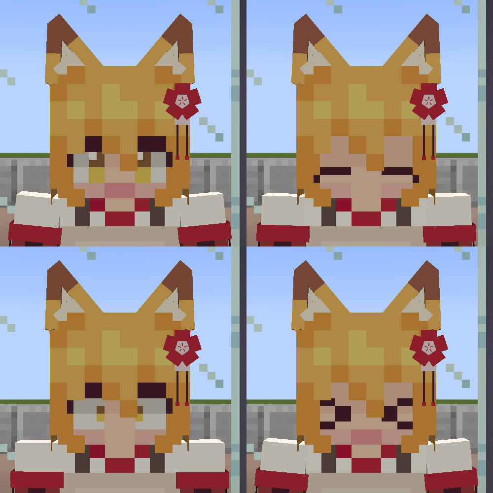

- Changes vanilla swords to [Naginatas](https://en.wikipedia.org/wiki/Naginata) (from episode 77 of the manga).
  - Holds the naginata when held in the main hand (not in the off hand).
  - Takes a defensive stance with naginata when using a shield while holding a naginata.

  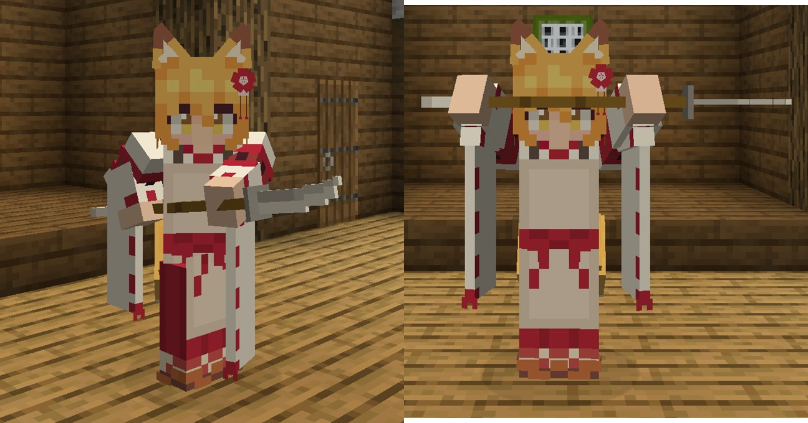

- Takes a special sleeping pose at bedtime.

  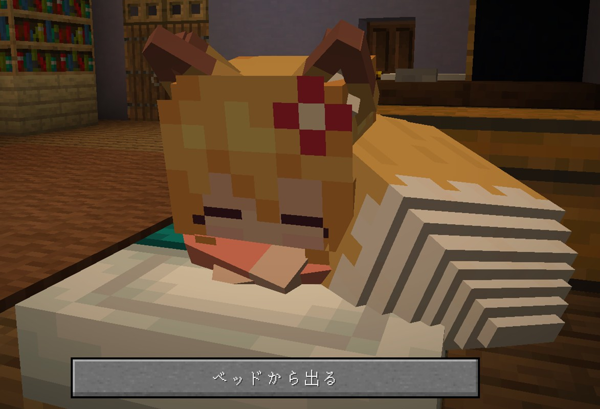

- Can change your display name to her name.
  - **Other players also need to install Figura and give enough permissions** to see your display name.

  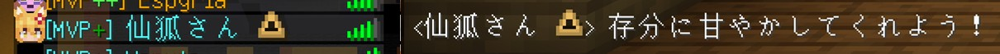

- Takes an umbrella if it's raining.
  - Won't get wet when taking it.
  - Won't take it when holding an item in off hand or playing an animation (of course, she gets wet in the case).
  - The umbrella open/close sound can disable in [the settings](#action-4-7-toggle-umbrella-openclose-sound).

  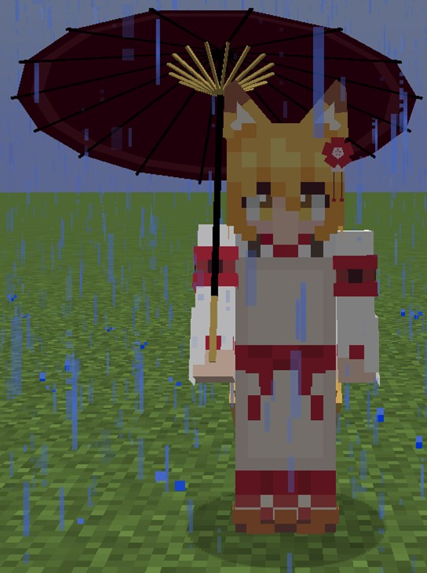

- Appears foxfires (small fireballs) around her when she has the night vision effect.
  - The number of foxfires is different depends on the character.
  - They are extinguished when getting wet.
  - Using a shader pack make them look more like foxfires thanks to its bloom effects.

  

## The action wheel
Figura provides the action wheel with which players can play some actions (emotes, animations, configs, and etc.). It will be shown when holding the action wheel key (default is B key). This avatar also has some actions.

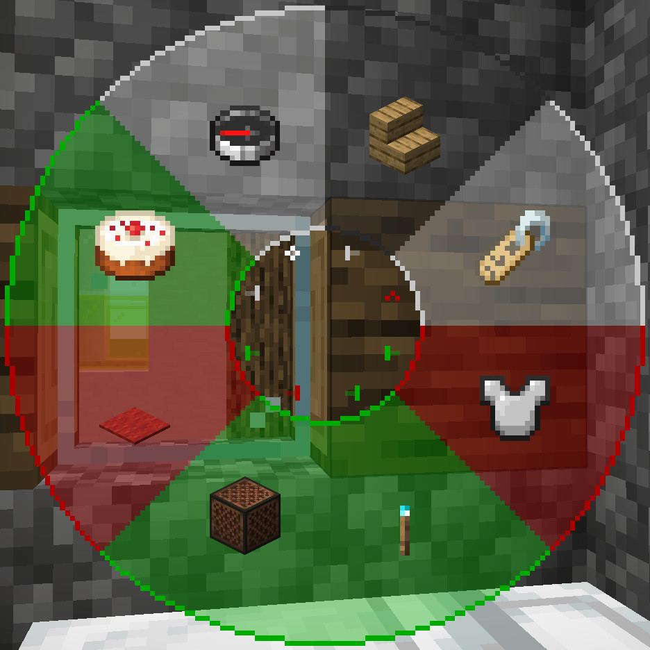

### Action 1. Sitting down
Sits down there. She will stand up when playing this action again. She will also stand up when moving, jumping, or sneaking while setting down.

### Action 2. Change display name
Changes the player's display name. Scroll to select the name and closing the action wheel to confirm. Left-click to reset to current selection, and right-clock to reset to default during selection. However, **Other players also need to install Figura and give enough permissions** to see your display name.

The name option which can be set are as follows:

- &lt;Player name&gt;
- Sora
- 夜空

### Action 3. Toggle armors visible
Toggles whether equipped armors are visible or not. This setting will only affects to vanilla armors.

### Action 4. Toggle foxfires visible in first person
Toggles whether foxfires are visible or not in the first person. Turn this off if you are annoyed with them when looking up.

### Action 5. Toggle umbrella open/close sound
Toggles whether the umbrella open/closed sounds are played or not. Turn this off if you are annoyed with them.

### Action 6. Toggle always umbrella use
Toggles whether she always use umbrella when she can use it even if it isn't raining. Can be used for photo shoots.

### Action 7. Toggle frequently shown messages
Toggles whether messages which are showed frequently show or not. This setting will not affects the action wheel messages. Turn this off if you are annoyed with them.

#### Action 8. Check for avatar updates
Left click to check for avatar updates. You can try to check updates again even if the check fails. In addition to manually checking for updates from here, the script will automatically check for updates once a day.

> [!IMPORTANT]
> To check for avatar updates, you must turn on "Allow Networking" and add `api.github.com` to the Network Filter from Figura settings!

> [!CAUTION]
> It is DANGEROUS to use a network filter other than "Whitelist" when activating Figura's Networking Feature. Although this avatar uses secure links, there is no guarantee that links used by other players' avatars are secure. I'm not responsible for any damages caused by using this feature.

> [!WARNING]
> If you repeatedly check for updates in a short period of time, GitHub will impose a temporary restriction and avatar scripts will not be able to check for updates for a while.

Right click to copy the latest avatar download link to your clipboard. Please access the download page from your browser.Please note that if you have not checked for updates once or have not checked for updates for a long period of time, you will not get the correct link.

## Avatar version display
From v1.26.0, when the action wheel is open, the version of avatar currently in use and whether it has been updated are displayed in the upper left corner of the screen.

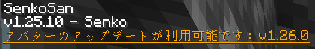

Updates are automatically checked once a day, but can also be done manually via the [action wheel](#action-8-check-for-avatar-updates).

A notification will be sent when a new avatar version is available. You can get the download link for the latest version from the [action wheel](#action-8-check-for-avatar-updates), which you can access from your browser.

> [!IMPORTANT]
> To check for avatar updates, you must turn on "Allow Networking" and add `api.github.com` to the Network Filter from Figura settings!

> [!CAUTION]
> It is DANGEROUS to use a network filter other than "Whitelist" when activating Figura's Networking Feature. Although this avatar uses secure links, there is no guarantee that links used by other players' avatars are secure. I'm not responsible for any damages caused by using this feature.

> [!WARNING]
> If you repeatedly check for updates in a short period of time, GitHub will impose a temporary restriction and avatar scripts will not be able to check for updates for a while.

## How to use
Figura is available in [Forge](https://files.minecraftforge.net/net/minecraftforge/forge/), [Fabric](https://fabricmc.net/) and [NeoForge](https://neoforged.net/).

1. Install the mod loader which you want to use and make the mods available.
2. Install [Figura](https://modrinth.com/mod/figura). Note the mod dependencies.
3. Go to the [release page](https://github.com/Gakuto1112/SenkoSan/releases).
   - You can also go there from the right side of [the repository's home page](https://github.com/Gakuto1112/SenkoSan).
4. Download the avatar of your choice that attached to "Assets" section of the release notes.
5. Unzip the zipped file and take the avatar data inside this.
6. Put avatar files at `<minecraft_instance_directory>/figura/avatars/`.
   - The directory will automatically generated after launching the game with Figura installed. You can also create it manually if it doesn't exist.
7. Open the Figura menu (Δ mark) from the game menu.
8. Select the avatar from the avatar list at the left of the Figura menu.
9. Sets your permission if you need.
10. Other Figura players can see your avatar after uploading your avatar to the Figura server.
    - **If your Minecraft is Pirated (cracked, unlicensed, free), you cannot upload your avatar.** This is a Figura specification and I cannot help you with this.

## Notes
- I'm not responsible for any damages caused by using this avatar.
- This avatar is designed for work with no resource pack and no other mods are installed. An unexpected issue may occurs when you use it with any resource packs and mods (texture and armor inconsistencies, etc.). However, I may not support you in these cases.
- Please [report an issue](https://github.com/Gakuto1112/SenkoSan/issues) if you find it.
- Please contact me via [Discussions](https://github.com/Gakuto1112/SenkoSan/discussions) or [Discord](https://discord.com/) if you want to do for my avatars. My Discord name is "vinny_san" and display name is "ばにーさん". My display name in [Figura Discord server](https://discord.gg/figuramc) is "BunnySan/ばにーさん".

## Links
- [Figura（Modrinth）](https://modrinth.com/mod/figura)
- [Figura（GitHub）](https://github.com/Moonlight-MC-Temp/Figura)
- [TVアニメ「世話やきキツネの仙狐さん」オフィシャルサイト](http://senkosan.com/)
- [Amazon.co.jp_ 世話やきキツネの仙狐さんを観る _ Prime Video](https://www.amazon.co.jp/gp/video/detail/B07QJG9NP7)
- [世話やきキツネの仙狐さん - Webで漫画が無料で読める！コミックNewtype](https://comic.webnewtype.com/contents/sewayaki/)

---

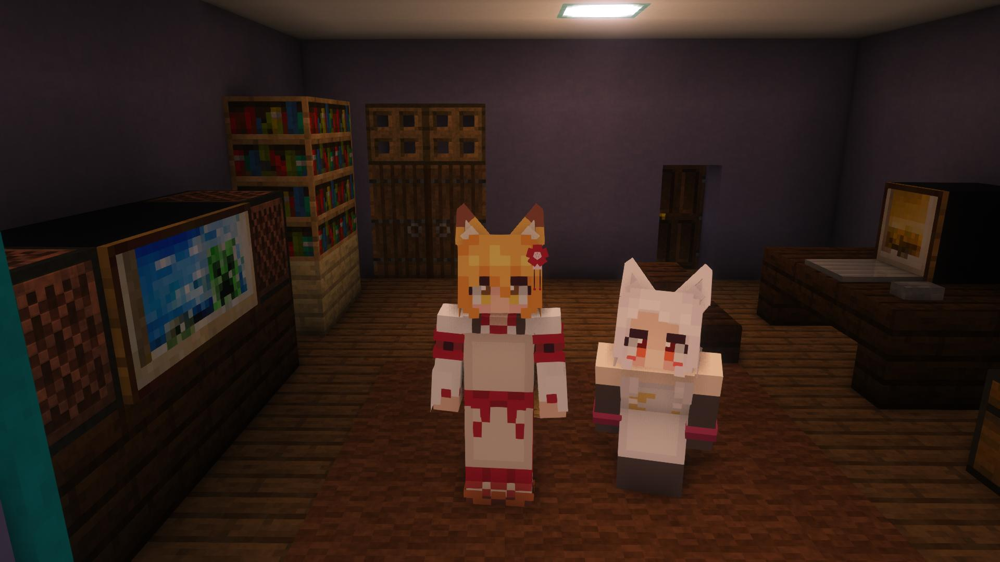

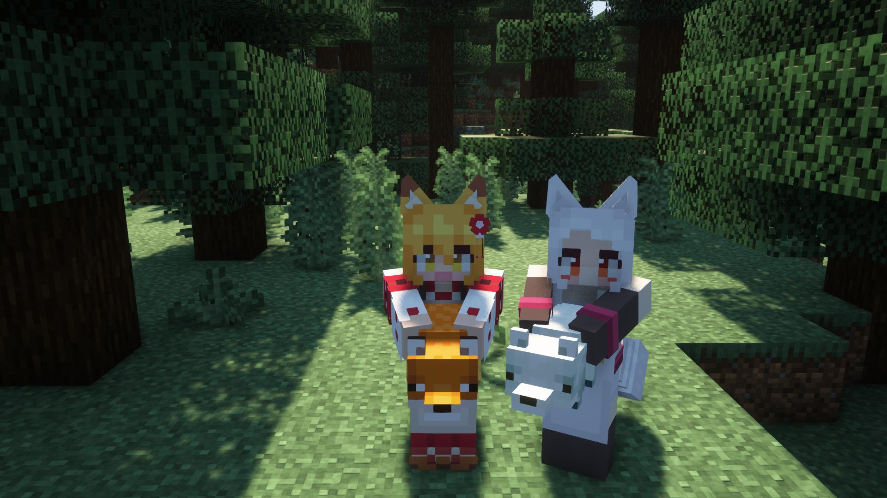

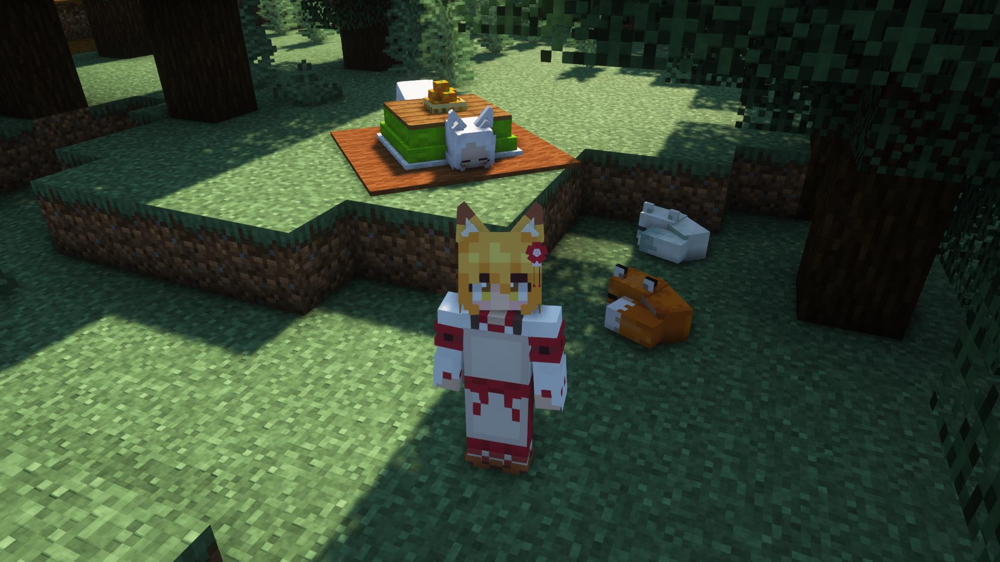

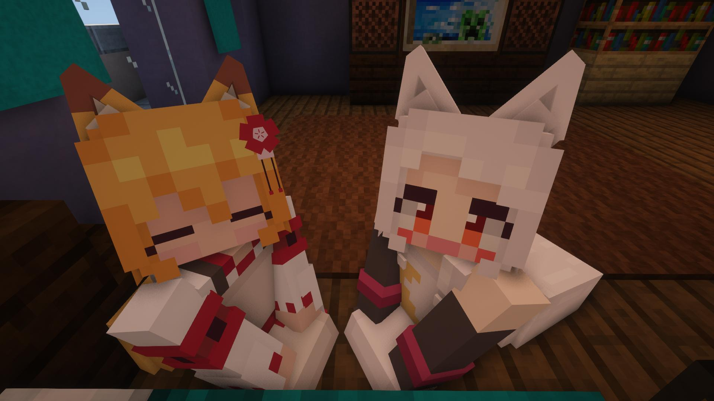

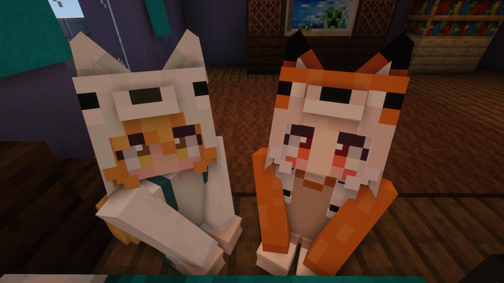
