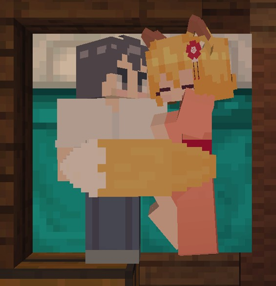
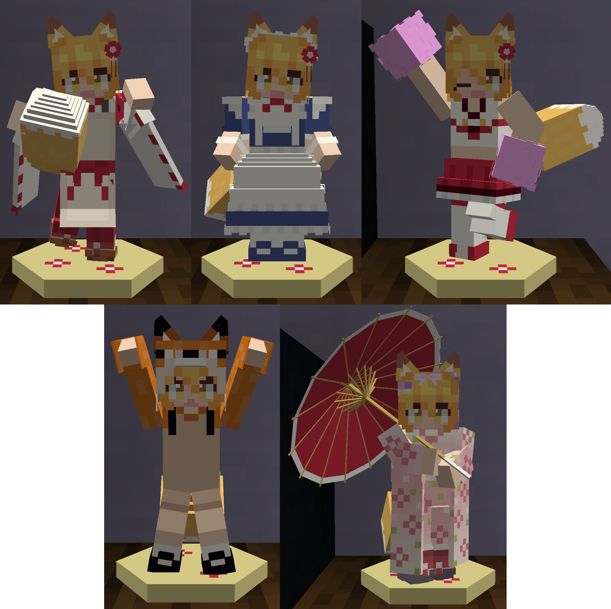
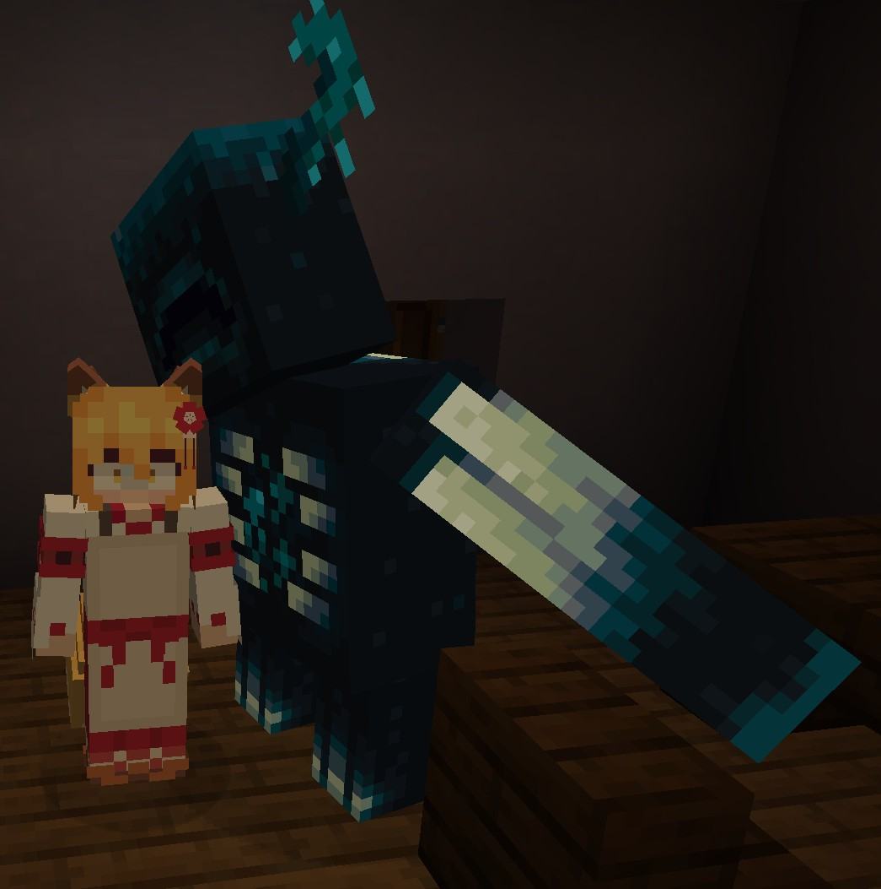
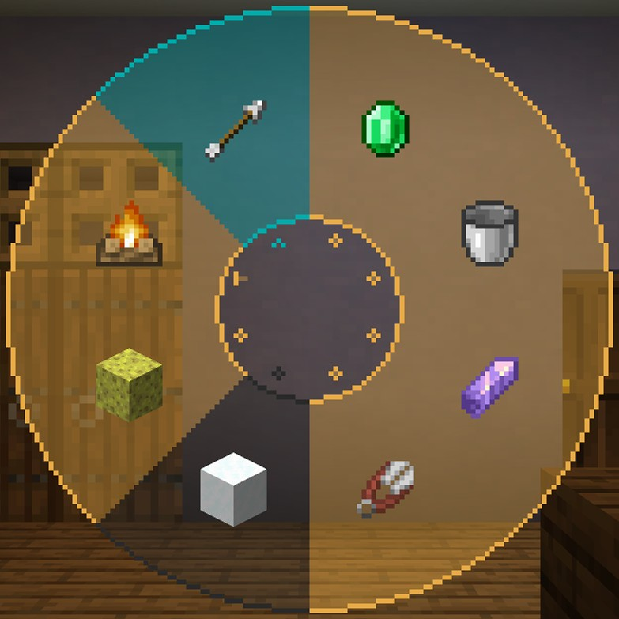
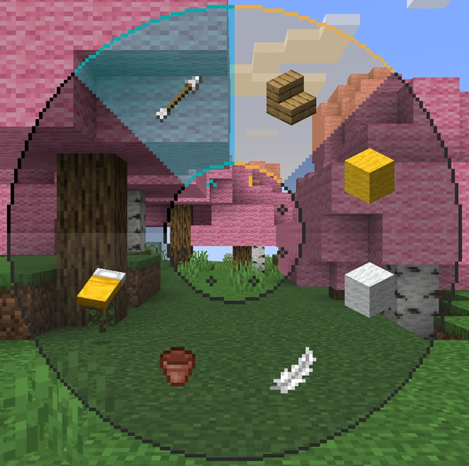
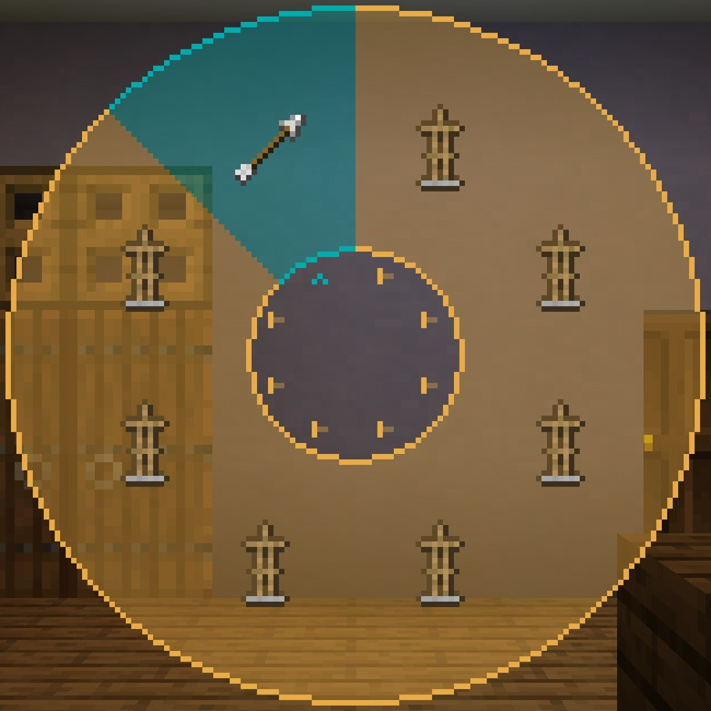

言語: 　[English](./README.md)　|　**日本語**

# ごあんない

ここは、**仙狐さん**のブランチです。


**シロ**のブランチは[こちら](https://github.com/Gakuto1112/SenkoSan/tree/Shiro)


**鈴**のブランチは[こちら](https://github.com/Gakuto1112/SenkoSan/tree/Suzu)


**夜空**のブランチは[こちら](https://github.com/Gakuto1112/SenkoSan/tree/Sora)

---

# SenkoSan（仙狐さん）
TVアニメ「世話やきキツネの仙狐さん」とその原作に登場するキャラクターを再現した、[Minecraft](https://www.minecraft.net/ja-jp)のスキンMod「[Figura](https://modrinth.com/mod/figura)」向けスキン「SenkoSan（仙狐さん）」です。

ターゲットFiguraバージョン：[0.1.1](https://modrinth.com/mod/figura/version/0.1.1+1.20.1-0f8b7a9)~


## 特徴
- 耳と尻尾のモデルが生えています。
  - 尻尾はプレイヤーの動きに合わせて揺れます。

    

  - 耳は**Xキー**、尻尾は**Zキー**で動かすことができます。

    

    

- 現在のHPや満腹度に応じてキャラクターの耳が垂れさがったり、表情が変わったりします。

  

- 時々瞬きします。
- [アクションホイール](#アクションホイール)で様々なアニメーションを実行できます。

  

- [アクションホイール](#アクション2-1-おすわり)で座ることができます。
  - 座らないと実行できないアニメーションがあります。

  

- カーソルキー（↑→↓←）を押すと、表情が変わります。

  

- 剣が薙刀になります（原作漫画第七十七尾）。
  - メインハンドで持つと薙刀を構えます（オフハンドでは構えません）。
  - 薙刀を構えながら盾で防御をすると、薙刀で防御する構えをとります。

  

- 就寝時は狐のような寝姿になります（第2話）。
  - 暗闇デバフを受けている時はまた別の寝姿（？）になります。

  

- 有効なダブルべッドで寝る場合は、仙狐さんが添い寝してくれます（第2話）。
  - 有効なダブルべッドとは、2つ（以上）のベッドが同じ向きで横に隣接しているかつ、そのべッドのどちらも使用中ではないこといいます。
  - ダミーのプレイヤーのスキンは、あなたのスキンになります。
  - ダミーのプレイヤーが寝ているベッドは実際には誰も寝ていないため、他のプレイヤーや村人がそのベッドで寝ることがあります（その場合は通常の睡眠アニメーションに変化します）。
  - 一人称視点で添い寝してもらうと...？

  

- 複数の衣装チェンジができます。どのような衣装があるかは[衣装カタログ](./costume_catalog_jp.md)をご覧ください。

  

- 写真撮影向けにいくつかポーズをとることができます。

  

- 一定時間放置すると尻尾を手入れしたり、こたつでくつろいだりします。

  

  

- あなたの表示名をキャラクターの名前に変更できます。
  - 他のプレイヤーがこの名前を見えるようにするには、**他のプレイヤーもFiguraを導入し、他のプレイヤー側であなたに対する信頼設定を十分上げる必要があります**。

  

- プレイヤーの頭ブロックが仙狐さんのフィギュアになります（[設定](#アクション4-3-プレイヤーの頭のタイプの変更)で変更できます）。
  - [画像右上のフィギュア](https://www.goodsmile.info/ja/product/9273/仙狐.html)
  - [画像上中央のフィギュア](https://www.geestore.com/detail/id/00000093048)
  - [画像右上のフィギュア](https://www.amazon.co.jp/gp/product/B07XZ6754D)
  - 画像左下のフィギュアは、漫画10巻裏のイラストを基に作成しました。
  - [画像右下のフィギュア](https://twitter.com/Kanda_omiyage/status/1627141001197531136?t=pWBnib7WuzlAD-uUdDcqIg&s=19)

  

- 水に触れると濡れてしまいます。
  - 水から上がると身震いして体に付いた水滴を飛ばします（[設定](#アクション4-4-自動ぶるぶるの切り替え)でオフにできます）。

    

  - 尻尾は水にぬれるとしなびてしまいます（第5話）。

    

- 雨が降っていると傘をさします。
  - 傘をさしている場合は雨で濡れることはありません。
  - オフハンドにアイテムを持っている時やアニメーションを再生した時は雨でも傘をしまいます（この場合はもちろん濡れます）。
  - 傘を開閉する音は[設定](#アクション4-7-傘の開閉音の切り替え)でオフにできます。

  

- 暗視が付与されていると周囲に狐火が出現します。
  - キャラクターによって出現する狐火の数は異なります。
  - 濡れている場合は消えてしまいます。
  - シェーダーパックを適用するとブルーム効果により、より狐火らしくなります。

  

- ウォーデンが付近いる（≒暗闇デバフを受けている）と、怯えて震えます。

  

  - 怯えている時は、エモートを拒否拒否するようになります。

    

## アクションホイール
Figuraには、アクションホイールキー（デフォルトは「B」キー）を押すことで、エモートなどを実行できるリングメニューが実装されています。このアバターにもいくつかのアクションが用意されています。

### ページ1（立ちアクション）



#### アクション1-1. にっこり（うやん♪）
他のアクションの最後で行うにっこりを単体で行います。左クリックでにっこりするだけ、右クリックで効果音とパーティクルも再生されます。


#### アクション1-2. ぶるぶる
水から上がった際のぶるぶるを手動で実行できます。


#### アクション1-3. お掃除
左クリックで箒掃除、右クリックで拭き掃除を行います。箒掃除にはレアパターンが存在します（レアパターンのアニメーションは第4話）。


#### アクション1-4. 散髪
プレイヤーの髪を整えてくれます（第9話、スキンはプレイヤーのスキンになります）。少し切り過ぎますが...


#### アクション1-5. きつねじゃんぷ
キツネのように雪に飛び込みます（第10話）。雪が十分に積もっており、十分なスペースが必要です。


#### アクション1-6. 尻尾の手入れ
尻尾にブラッシングをかけ、尻尾のモフリティを上げます（原作漫画第十六.五尾）。このアクションは立っていても座っていても実行できます。


#### アクション1-7. こたつ
こたつに入ってだらーんとします（第10話）。このアクションは、プレイヤーが移動する等の要因によってアクションがキャンセルされるまで実行され続けます（時間経過により止まることはありません）。


### ページ2（座りアクション）



#### アクション2-1. おすわり
その場に座ります。もう一度アクション実行で立ち上がります。座っている時に動いたり、ジャンプしたり、スニークしたりすると自動で立ち上がります。


#### アクション2-2. 尻尾もふもふ
プレイヤーが仙狐さんの尻尾をモフモフします（第1話、スキンはプレイヤーのスキンになります）。このアクションを実行するには先に座って下さい。ただし、お出かけ服や防具表示状態でチェストプレートを着用している場合は実行できません。


#### アクション2-3. お耳もふもふ
プレイヤーが仙狐さんの耳をモフモフします（第2話、スキンはプレイヤーのスキンになります）。このアクションを実行するには先に座って下さい。ただし、耳が覆われるような衣装を着用している場合は実行できません。


#### アクション2-4. 耳かき
膝枕でプレイヤーの耳を掃除してくれます（第2話、スキンはプレイヤーのスキンになります）。このアクションを実行するには先に座って下さい。


#### アクション2-5. お茶
ほうじ茶を飲んで一息つきます（第6話）。このアクションを実行するには先に座って下さい。


#### アクション2-6. まっさーじ
プレイヤーの肩をほぐしてくれます（第7話、スキンはプレイヤーのスキンになります）。このアクションを実行するには先に座って下さい。


### ページ3（撮影ポーズ）



7種類のポーズをとることができます。写真撮影にどうぞ。尚、撮影ポーズ7は、小道具として傘を使用します。


### ページ4（アバター設定1）


#### アクション4-1. 衣装変更
仙狐さんの[衣装](./costume_catalog_jp.md)を変更します。スクロールで衣装を変更し、アクションホイールを閉じると確定します。選択中に左クリックをすると現在の設定値に、右クリックすると初期値にリセットされます。

#### アクション4-2. 名前変更
プレイヤーの表示名を変更します。スクロールで表示名を選択し、アクションホイールを閉じると確定します。選択中に左クリックをすると現在の設定値に、右クリックすると初期値にリセットされます。ただし、他のプレイヤーが変更された名前を見るには、**そのプレイヤーもFiguraを導入し、他のプレイヤー側であなたに対する信頼設定を十分上げる必要があります**。


設定できる名前の選択肢は以下の通りです。

- <プレイヤー名>
- Senko
- 仙狐
- Senko_san
- 仙狐さん
- Sen
- 仙
- セン

#### アクション4-3. プレイヤーの頭のタイプの変更
アバターの「プレイヤーの頭」のモデルタイプを変更します。選択中に左クリックをすると現在の設定値に、右クリックすると初期値にリセットされます。


設定できるモデル選択肢は以下の通りです。

- デフォルト（アバターの頭のみのモデル）
- フィギュア（[参考](https://www.goodsmile.info/ja/product/9273/仙狐.html)）
- メイドのフィギュア（[参考](https://www.geestore.com/detail/id/00000093048)）
- チアリーダーのフィギュア（[参考](https://www.amazon.co.jp/gp/product/B07XZ6754D)）
- きつねパーカーのフィギュアは、漫画10巻裏のイラストを基に作成しました。
- 着物のフィギュア（[参考](https://twitter.com/Kanda_omiyage/status/1627141001197531136?t=pWBnib7WuzlAD-uUdDcqIg&s=19)）

Mobが被っているプレイヤーの頭は設定に関わらず、デフォルトの頭になります。

プレイヤーの頭はチートモードで以下のコマンドを入力すると入手できます：
```
/give @p minecraft:player_head{SkullOwner: "<プレイヤー名>"} 1
```

#### アクション4-4. 自動ぶるぶるの切り替え
濡れている際に自動的に[ぶるぶる](#アクション1-2-ぶるぶる)を実行するかどうかを設定できます。

#### アクション4-5. 防具の表示の切り替え
防具を表示するかどうかを設定できます。一部の[衣装](./costume_catalog_jp.md)は防具と干渉しないように、防具装備中は非表示になります。この設定はバニラの防具にのみ対応しています。

#### アクション4-6. 一人称視点での狐火の表示の切り替え
一人称視点で狐火のパーティクルを表示するかどうかを設定できます。上を向いた際に、頭上の狐火が煩わしいと感じる場合はオフにして下さい。


#### アクション4-7. 傘の開閉音の切り替え
傘の開閉音を再生するかどうかを設定できます。傘の開閉音が煩わしいと感じる場合はオフにして下さい。

### ページ5（アバター設定2）


#### アクション5-1. 常に傘をさす
傘を差せる状況下において、雨が降っていなくても常に傘をさします。撮影用途などにどうぞ。


#### アクション5-2. メッセージの表示
アクションホイールでのメッセージ以外の、良く表示されるであろう一部メッセージを表示するかどうかを設定できます。メッセージが煩わしいと感じる場合はオフにして下さい。

## 使用方法
Figuraは[Forge](https://files.minecraftforge.net/net/minecraftforge/forge/)、[Fabric](https://fabricmc.net/)、[Quilt](https://quiltmc.org/)に対応しています。

1. 使用したいModローダーをインストールし、Modを使用できる状態にします。
2. [Figura](https://modrinth.com/mod/figura)を追加します。Modの依存関係にご注意ください。
3. 使用したいキャラクターのダウンロードページに移動します。
4. ページ上部の緑色のボタン「**Code**」から「**Download ZIP**」からこのレポジトリのファイルをダウンロードします。（または、このレポジトリをクローンします。）
5. 圧縮ファイルの場合は展開します。
6. `<マインクラフトのゲームフォルダ>/figura/avatars/`にアバターのデータを配置します。
   - Figuraを導入した状態で一度ゲームを起動すると自動的に作成されます。存在しない場合は手動での作成も可能です。
7. ゲームメニューからFiguraメニュー（Δマーク）を開きます。
8. 画面左のアバターリストからアバターを選択します。
9. 必要に応じて権限設定をして下さい。
10. アバターをサーバーにアップロードすると、他のFiguraプレイヤーもあなたのアバターを見ることができます。

## 注意事項
- このアバターを使用して発生した、いかなる損害の責任も負いかねます。
- このアバターは、デフォルトのリソースパックでの動作を想定しています。また、他MODの使用は想定していません。想定動作環境外ではテクスチャの不整合、防具が表示されない/非表示にならない、といった不具合が想定されます。この場合の不具合は対応しませんのでご了承下さい。
- 不具合がありましたら、[Issues](https://github.com/Gakuto1112/SenkoSan/issues)までご連絡下さい。

## リンク集
- [Figura（Modrinth）](https://modrinth.com/mod/figura)
- [Figura（GitHub）](https://github.com/Moonlight-MC-Temp/Figura)
- [TVアニメ「世話やきキツネの仙狐さん」オフィシャルサイト](http://senkosan.com/)
- [Amazon.co.jp_ 世話やきキツネの仙狐さんを観る _ Prime Video](https://www.amazon.co.jp/gp/video/detail/B07QJG9NP7)
- [世話やきキツネの仙狐さん - Webで漫画が無料で読める！コミックNewtype](https://comic.webnewtype.com/contents/sewayaki/)

---


