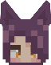
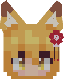
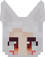
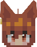
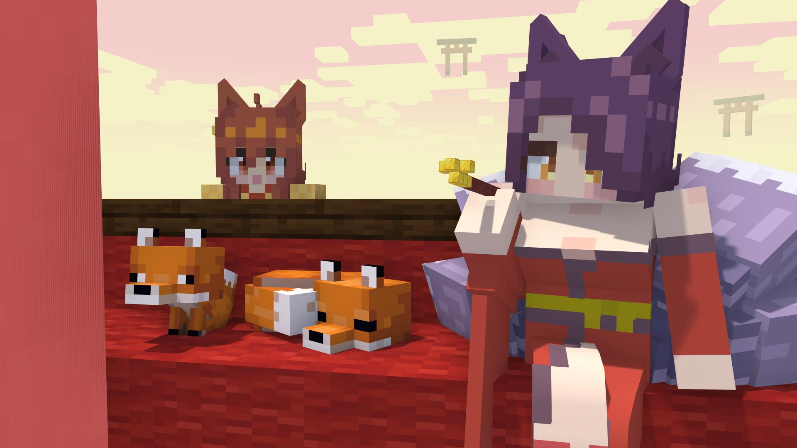
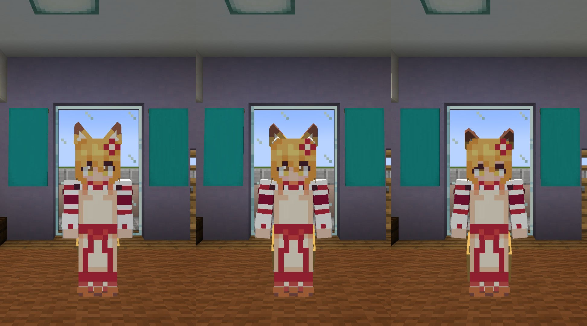
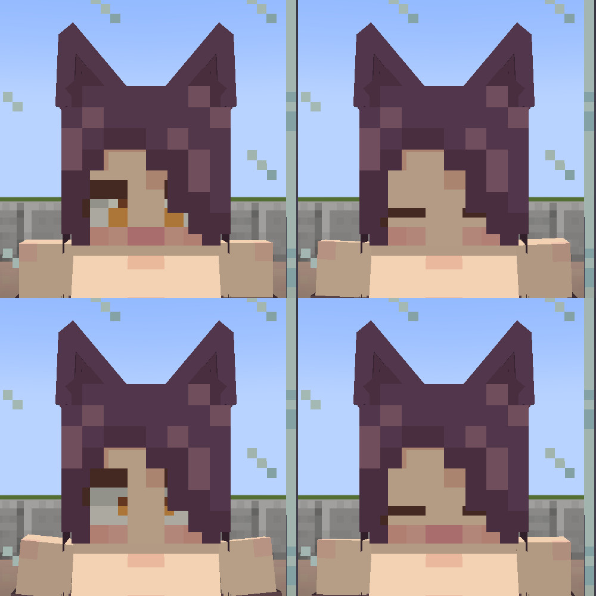
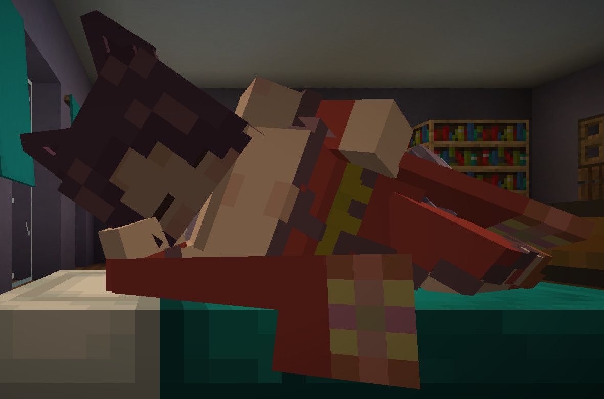
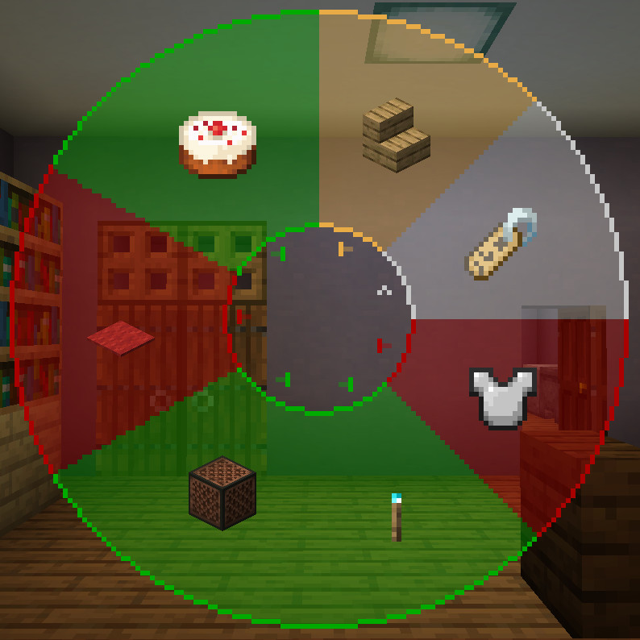

<!-- $inject(locale_link) -->

# ごあんない

ここは、**夜空**の配布ページです。

**仙狐さん**の配布ページは[こちら](https://github.com/Gakuto1112/SenkoSan)

**シロ**の配布ページは[こちら](https://github.com/Gakuto1112/SenkoSan/tree/Shiro)

**鈴**の配布ページは[こちら](https://github.com/Gakuto1112/SenkoSan/tree/Suzu)

# Sora（夜空）
TVアニメ「世話やきキツネの仙狐さん」とその原作に登場するキャラクターを再現した、MinecraftのスキンMod「[Figura](https://modrinth.com/mod/figura)」向けスキン「Sora（夜空）」です。

ターゲットFiguraバージョン：[0.1.1](https://modrinth.com/mod/figura/version/0.1.1+1.20.1-0f8b7a9)~

## 特徴
- 耳と尻尾のモデルが生えています。
  - 尻尾はプレイヤーの動きに合わせて揺れます。

    

  - 耳は**Xキー**、尻尾は**Zキー**で動かすことができます。

    

    

- 現在のHPや満腹度に応じてキャラクターの耳が垂れさがったり、表情が変わったりします。

  

- 時々瞬きします。

- [アクションホイール](#the-action-wheel)で座ることができます。

  

- カーソルキー（↑→↓←）を押すと、表情が変わります。

  

- 剣が薙刀になります（原作漫画第七十七尾）。
  - メインハンドで持つと薙刀を構えます（オフハンドでは構えません）。
  - 薙刀を構えながら盾で防御をすると、薙刀で防御する構えをとります。

  

- 就寝時は特別な寝姿になります。

  

- あなたの表示名をキャラクターの名前に変更できます。
  - 他のプレイヤーがこの名前を見えるようにするには、**他のプレイヤーもFiguraを導入し、他のプレイヤー側であなたに対する信頼設定を十分上げる必要があります**。

  

- 雨が降っていると傘をさします。
  - 傘をさしている場合は雨で濡れることはありません。
  - オフハンドにアイテムを持っている時やアニメーションを再生した時は雨でも傘をしまいます（この場合はもちろん濡れます）。
  - 傘を開閉する音は[設定](#アクションホイール33アバター設定)でオフにできます。

  

- 暗視が付与されていると周囲に狐火が出現します。
  - キャラクターによって出現する狐火の数は異なります。
  - 濡れている場合は消えてしまいます。
  - シェーダーパックを適用するとブルーム効果により、より狐火らしくなります。

  

## The action wheel
Figuraには、アクションホイールキー（デフォルトは「B」キー）を押すことで、エモートなどを実行できるリングメニューが実装されています。このアバターにもいくつかのアクションが用意されています。

### アクション1. お座り
その場に座ります。もう一度アクション実行で立ち上がります。座っている時に動いたり、ジャンプしたり、スニークしたりすると自動で立ち上がります。

### アクション2. 名前変更
プレイヤーの表示名を変更します。スクロールで表示名を選択し、アクションホイールを閉じると確定します。選択中に左クリックをすると現在の設定値に、右クリックすると初期値にリセットされます。ただし、他のプレイヤーが変更された名前を見るには、**そのプレイヤーもFiguraを導入し、他のプレイヤー側であなたに対する信頼設定を十分上げる必要があります**。

設定できる名前の選択肢は以下の通りです。

- <プレイヤー名>
- Sora
- 夜空

### アクション3. 防具の表示の切り替え
防具を表示するかどうかを設定できます。この設定はバニラの防具にのみ対応しています。

### アクション4. 一人称視点での狐火の表示の切り替え
一人称視点で狐火を表示するかどうかを設定できます。上を向いた際などに、頭上の狐火が煩わしいと感じる場合はオフにして下さい。

### アクション5. 傘の開閉音の切り替え
傘の開閉音を再生するかどうかを設定できます。傘の開閉音が煩わしいと感じる場合はオフにして下さい。

### アクション6. 常に傘をさす
傘を差せる状況下において、雨が降っていなくても常に傘をさします。撮影用途などにどうぞ。

### アクション7. メッセージの表示
アクションホイールでのメッセージ以外の、良く表示されるであろう一部メッセージを表示するかどうかを設定できます。メッセージが煩わしいと感じる場合はオフにして下さい。

<!-- $inject(how_to_use) -->

<!-- $inject(notes) -->

## リンク集
- [Figura（Modrinth）](https://modrinth.com/mod/figura)
- [Figura（GitHub）](https://github.com/Moonlight-MC-Temp/Figura)
- [TVアニメ「世話やきキツネの仙狐さん」オフィシャルサイト](http://senkosan.com/)
- [Amazon.co.jp_ 世話やきキツネの仙狐さんを観る _ Prime Video](https://www.amazon.co.jp/gp/video/detail/B07QJG9NP7)
- [世話やきキツネの仙狐さん - Webで漫画が無料で読める！コミックNewtype](https://comic.webnewtype.com/contents/sewayaki/)

***

