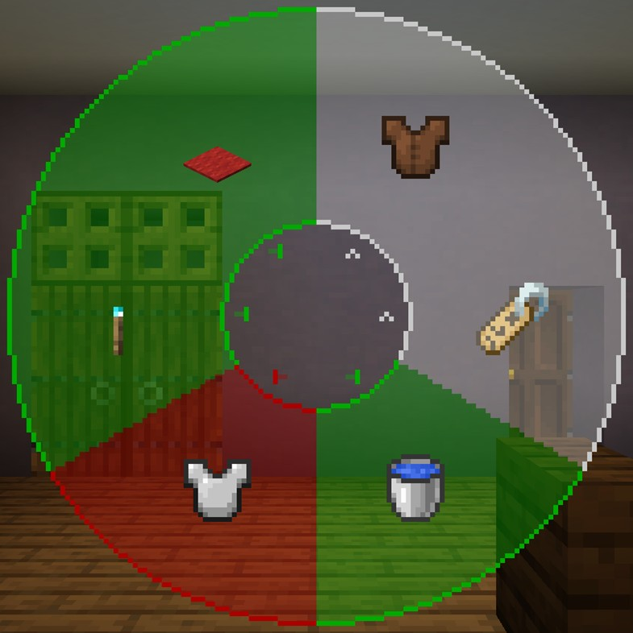
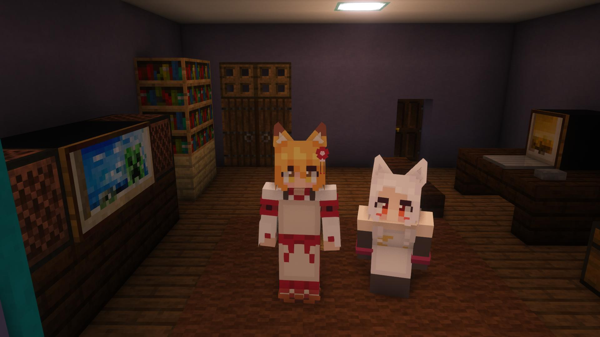
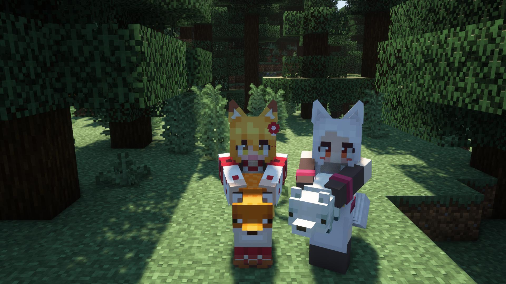
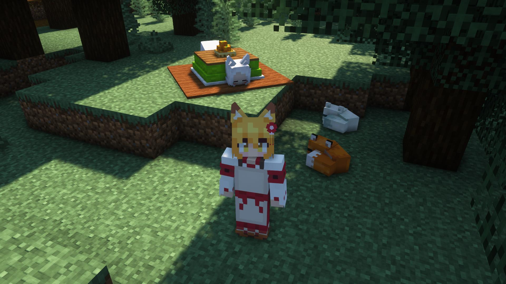

# SenkoSan（仙狐さん）
TVアニメ「世話やきキツネの仙狐さん」（とその原作）に登場するキャラクターを再現した、MinecraftのスキンMod「[Figura](https://www.curseforge.com/minecraft/mc-mods/figura)」向けスキン「SenkoSan（仙狐さん）」です。

**このREADMEには本来、大量の画像（約79MB）を添付していますが、通信量の軽減のため、必要最低限以外の画像は添付されおりません。画像を確認するには、それぞれの画像のリンクをクリックするか、[README（完全版）](./.github/workflows/README_full.md)をご覧ください。**

ターゲットFiguraバージョン：[0.1.0-rc.13](https://www.curseforge.com/minecraft/mc-mods/figura/files/4300619)

## 特徴
- 耳と尻尾のモデルが生えています。
  - 尻尾はプレイヤーの動きに合わせて揺れます。

    [[画像] 尻尾が揺れる](README_images/尻尾が揺れる.gif)
  - 耳は**Xキー**、尻尾は**Zキー**で動かすことができます。

    [[画像] 耳を動かす](README_images/耳を動かす.gif)
    [[画像] 尻尾を動かす](README_images/尻尾を動かす.gif)
- 現在のHPや満腹度に応じてキャラクターの耳が垂れさがったり、表情が変わったりします。

  [[画像] HPとアバター](README_images/HPとアバター.jpg)
- 時々瞬きします。
- [アクションホイール](#アクションホイール13)で様々なアニメーションを実行できます。

  [[画像] 箒掃除](README_images/箒掃除.gif)
- [アクションホイール](#アクションホイール23)で座ることができます。
  - 座らないと実行できないアニメーションがあります。

  [[画像] おすわり](README_images/おすわり.jpg)
- 就寝時は狐のような寝姿になります（第2話）。
  - 暗闇デバフを受けている時はまた別の寝姿（？）になります。

  [[画像] 寝姿](README_images/寝姿.jpg)
- 複数の衣装チェンジができます。どのような衣装があるかは[衣装カタログ](衣装一覧.md)をご覧ください。

  [[画像] 衣装](README_images/衣装.gif)
- あなたの表示名をキャラクターの名前に変更できます。
  - 他のプレイヤーがこの名前を見えるようにするには、**他のプレイヤーもFiguraを導入し、他のプレイヤー側であなたに対する信頼設定を十分上げる必要があります**。
  - 0.1.0-rc11～では、一時的にプレイヤーリストのアバター表示が無効になっています。
    > added a new setting to toggle whether UI elements should render the avatar portrait instead of the vanilla skin, (default OFF)

    > currently locked as of the portrait rendering is VERY glitchy

  [[画像] 名前変更](README_images/名前変更.jpg)
- プレイヤーの頭ブロックが仙狐さんのフィギュアになります（[設定](#アバター設定)で変更できます）。
  - [画像左のフィギュア](https://www.goodsmile.info/ja/product/9273/仙狐.html)
  - [画像中央のフィギュア](https://www.geestore.com/detail/id/00000093048)
  - [画像右のフィギュア](https://www.amazon.co.jp/gp/product/B07XZ6754D)

  [[画像] プレイヤーの頭](README_images/プレイヤーの頭.jpg)
- 水に触れると濡れてしまいます。
  - 水から上がると身震いして体に付いた水滴を飛ばします（[設定](#アバター設定)でオフにできます）。

    [[画像] ぶるぶる](README_images/ブルブル.gif)
  - 尻尾は水にぬれるとしなびてしまいます（第5話）。

    [[画像] しなびた尻尾](README_images/しなびた尻尾.jpg)
- 雨が降っていると傘をさします。
  - 傘をさしている場合は雨で濡れることはありません。
  - オフハンドにアイテムを持っている時やアニメーションを再生した時は雨でも傘をしまいます（この場合はもちろん濡れます）。
  - 傘を開閉する音は[設定](#アバター設定)でオフにできます。

  [[画像] 傘](README_images/傘.jpg)
- 暗視が付与されていると頭上に狐火が出現します。
  - 濡れている場合は消えてしまいます。

- 特定のGUIが開いている間は眼鏡をかけます（第4話）。

  [[画像] 眼鏡](README_images/眼鏡.jpg)
- ウォーデンが付近いる（≒暗闇デバフを受けている）と、怯えて震えます。

  [[画像] ウォーデンに怯える](README_images/ウォーデンに怯える.jpg)
  - 怯えている時は、エモートを拒否拒否するようになります。

    [[画像] エモート拒否](README_images/エモート拒否.gif)
## アクションホイール（1/3）
Figuraには、アクションホイールキー（デフォルトは「B」キー）を押すことで、エモートなどを実行できるリングメニューが実装されています。このアバターにもいくつかのアクションが用意されています。

### アクション1-1. にっこり（うやん♪）
他のアクションの最後で行うにっこりを単体で行います。左クリックでにっこりするだけ、右クリックで効果音とパーティクルも再生されます。

[[画像] にっこり](README_images/にっこり.jpg)
### アクション1-2. ぶるぶる
水から上がった際のぶるぶるを手動で実行できます。

[[画像] ぶるぶる](README_images/ブルブル.gif)
### アクション1-3. お掃除
左クリックで箒掃除、右クリックで拭き掃除を行います。箒掃除にはレアパターンが存在します（レアパターンのアニメーションは第4話）。

[[画像] 箒掃除](README_images/箒掃除.gif)
[[画像] 拭き掃除](README_images/拭き掃除.gif)
### アクション1-4. 散髪
プレイヤーの髪を整えてくれます（第9話、スキンはプレイヤーのスキンになります）。少し切り過ぎますが...

[[画像] 散髪](README_images/散髪.gif)
### アクション1-5. きつねじゃんぷ
キツネのように雪に飛び込みます（第10話）。雪が十分に積もっており、十分なスペースが必要です。

[[画像] きつねジャンプ](README_images/きつねジャンプ.gif)
### アクション1-6. 尻尾の手入れ
尻尾にブラッシングをかけ、尻尾のモフリティを上げます（原作漫画）。このアクションは立っていても座っていても実行できます。

[[画像] 尻尾の手入れ](README_images/尻尾の手入れ.gif)
### アクション1-7. こたつ
こたつに入ってだらーんとします（第10話）。このアクションは、プレイヤーが移動する等の要因によってアクションがキャンセルされるまで実行され続けます（時間経過により止まることはありません）。

[[画像] こたつ](README_images/こたつ.jpg)
## アクションホイール（2/3）

### アクション2-1. おすわり
その場に座ります。もう一度アクション実行で立ち上がります。座っている時に動いたり、ジャンプしたり、スニークしたりすると自動で立ち上がります。

[[画像] おすわり](README_images/おすわり.jpg)
### アクション2-2. 尻尾もふもふ
プレイヤーが仙狐さんの尻尾をモフモフします（第1話、スキンはプレイヤーのスキンになります）。このアクションを実行するには先に座って下さい。ただし、変装服や防具表示状態でチェストプレートを着用している場合は実行できません。

[[画像] 尻尾モフモフ](README_images/尻尾モフモフ.gif)
### アクション2-3. 耳かき
膝枕でプレイヤーの耳を掃除してくれます（第2話、スキンはプレイヤーのスキンになります）。このアクションを実行するには先に座って下さい。

[[画像] 耳かき](README_images/耳かき.gif)
### アクション2-4. お茶
ほうじ茶を飲んで一息つきます（第6話）。このアクションを実行するには先に座って下さい。

[[画像] お茶](README_images/お茶.gif)
### アクション2-5. まっさーじ
プレイヤーの肩をほぐしてくれます（第7話、スキンはプレイヤーのスキンになります）。このアクションを実行するには先に座って下さい。

[[画像] マッサージ](README_images/マッサージ.gif)
## アクションホイール（3/3）

### アクション3-1. アバター設定
アバター各種設定を行う画面に遷移します。詳しくは[アバター設定](#アバター設定)をご覧下さい。

## アバター設定
[アクション3-1](#アクション3-1-アバター設定)を実行するとこの画面が表示されます。一度アクションホイールを閉じると、設定画面を閉じることができます。

### アクション1. 衣装変更
仙狐さんの[衣装](衣装一覧.md)を変更します。スクロールで衣装を変更し、アクションホイールを閉じると確定します。選択中に左クリックをすると、現在の設定値にリセットされます。

### アクション2. 名前変更
プレイヤーの表示名を変更します。スクロールで表示名を選択し、アクションホイールを閉じると確定します。選択中に左クリックをすると、現在の設定値にリセットされます。ただし、他のプレイヤーが変更された名前を見るには、**そのプレイヤーもFiguraを導入し、他のプレイヤー側であなたに対する信頼設定を十分上げる必要があります**。

[[画像] 名前変更](README_images/名前変更.jpg)
設定できる名前の選択肢は以下の通りです。

- <プレイヤー名>
- Shiro
- シロ

### アクション3. プレイヤーの頭のタイプの変更
アバターの「プレイヤーの頭」のモデルタイプを変更します。

[[画像] プレイヤーの頭](README_images/プレイヤーの頭.jpg)
設定できるモデル選択肢は以下の通りです。

- デフォルト（アバターの頭のみのモデル）
- フィギュア（[参考](https://www.goodsmile.info/ja/product/9273/仙狐.html)）
- メイドのフィギュア（[参考](https://www.geestore.com/detail/id/00000093048)）
- チアリーダーのフィギュア（[参考](https://www.amazon.co.jp/gp/product/B07XZ6754D)）

Mobが被っているプレイヤーの頭は設定に関わらず、デフォルトの頭になります。ただし、この処理は[rc.13のバグ](https://discord.com/channels/805969743466332191/1047331739678281728)を利用しているので、今後この仕様は変更される可能性があります。

因みに、プレイヤーの頭は以下のコマンドで入手できます：`/give @p minecraft:player_head{SkullOwner: "<プレイヤー名>"} 1`

### アクション4. 自動ぶるぶるの切り替え
濡れている際に自動的に[ぶるぶる](#アクション1-2-ぶるぶる)を実行するかどうかを設定できます。

### アクション5. 防具の表示の切り替え
防具を表示するかどうかを設定できます。一部の[衣装](衣装一覧.md)は防具と干渉しないように、防具装備中は非表示になります。この設定はバニラの防具にのみ対応しています。

### アクション6. 一人称視点での狐火の表示の切り替え
一人称視点で狐火のパーティクルを表示するかどうかを設定できます。上を向いた際に、頭上の狐火が煩わしいと感じる場合はオフにして下さい。

### アクション7. 傘の開閉音の切り替え
傘の開閉音を再生するかどうかを設定できます。傘の開閉音が煩わしいと感じる場合はオフにして下さい。

## 使用方法
1. マインクラフトに[Fabric](https://fabricmc.net/)をインストールし、[Fabric API](https://www.curseforge.com/minecraft/mc-mods/fabric-api)と[Figura 0.1.0-rc.13](https://www.curseforge.com/minecraft/mc-mods/figura/files/4300619)を追加します。各Modの依存関係にご注意ください。
2. ページ上部の緑色のボタン「**Code**」から「**Download ZIP**」からこのレポジトリのファイルをダウンロードします。（または、このレポジトリをクローンします。）
3. 圧縮ファイルの場合は展開します。
   - 以下のファイル、フォルダはアバターの動作には不要なので削除しても構いません。
     - [.github](.github/)
     - [README_images](README_images/)
     - [.gitignore](.gitignore)
     - [CONTRIBUTING.md](CONTRIBUTING.md)
     - [README.md](README.md)
     - [衣装一覧.md](衣装一覧.md)
4. ``<マインクラフトのゲームフォルダ>/figura/avatars/``にアバターのデータを配置します。
   - フォルダはFiguraを追加したマインクラフトを一度起動すると自動的に生成されます。ない場合は手動で作成しても構いません。
5. ゲームメニューからFiguraメニュー（Δマーク）を開き、画面左のアバターリストから「仙狐さん」を選択します。
6. 必要に応じて[権限設定](#推奨設定)をして下さい。
7. アバターをサーバーにアップロードすると、他のFiguraプレイヤーもあなたのアバターを見ることができます。

## 推奨設定
### 信用度設定（Trust）
デフォルトの信頼度設定において、**Trusted**以上必須！

あなただけではなく、あなたのアバターを見る他のプレイヤーも同様に、あなたの信頼度を上げる必要があります！

| 項目 | 推奨設定 | 備考 |
| - | - | - |
| Vanilla Model Change | **有効！！** | これが有効でないと、バニラのプレイヤーモデルが消えません！！ |
| Nameplate Change | 有効 | |
| Custom Player Heads | 有効 | |

### Figura設定（Settings）
「Δ」のマークが付いている項目は、Figuraのデフォルト設定がこのアバターの推奨設定となっています。

| 項目 | 推奨設定 | 備考 |
| - | - | - |
| Chat customizations Δ | "Script" または "Script + Badges" | |
| Entity customizations Δ | "Script" または "Script + Badges" | |
| Tablist customizations Δ | "Script" または "Script + Badges" | |
| Print Output Δ | "Chat" | |
| First Person Hands Δ | 無効 | |
| Chat Emojis Δ | 無効 | 一部のメッセージの文字色が意図しないものになってしまいます。 |

### マインクラフト設定
| 項目 | 推奨設定 | 備考 |
| - | - | - |
| キー設定 | 「尻尾ふりふり」や「お耳ぴくぴく」と同じキー割り当てを行わない | |
| 言語設定 | 日本語 | 日本語以外の言語では英語表示になります。また、英語への翻訳は正確でない可能性があります。 |
| バニラのスキン | 仙狐さんをモチーフにしたスキンにしない | 癒されるのはあなた自身なので。 |

## 注意事項
- このアバターを使用して発生した、いかなる損害の責任も負いかねます。
- このアバターは、デフォルトのリソースパックでの動作を想定しています。また、他MODの使用は想定していません。想定動作環境外ではテクスチャの不整合、防具が表示されない/非表示にならない、といった不具合が想定されます。この場合の不具合は対応しませんのでご了承下さい。
- 不具合がありましたら、[Issues](https://github.com/Gakuto1112/SenkoSan/issues)までご連絡下さい。

## リンク集
- [Figura（CurseForge）](https://www.curseforge.com/minecraft/mc-mods/figura)
- [Figura（Modrinth）](https://modrinth.com/mod/figura)
- [TVアニメ「世話やきキツネの仙狐さん」オフィシャルサイト](http://senkosan.com/)
- [Amazon.co.jp_ 世話やきキツネの仙狐さんを観る _ Prime Video](https://www.amazon.co.jp/gp/video/detail/B07QJG9NP7)
- [世話やきキツネの仙狐さん - Webで漫画が無料で読める！コミックNewtype](https://comic.webnewtype.com/contents/sewayaki/)

***

