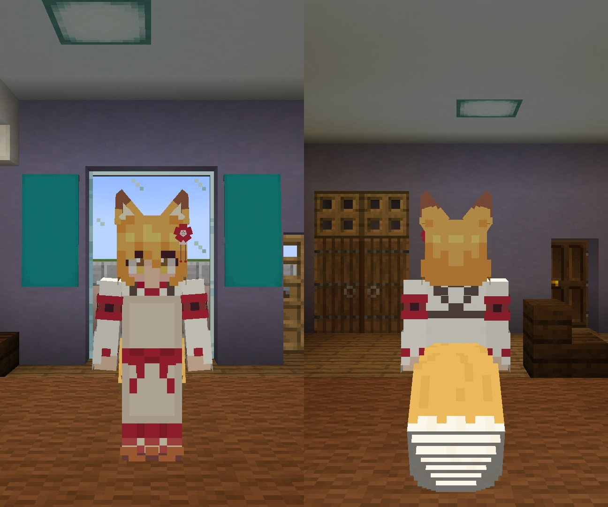
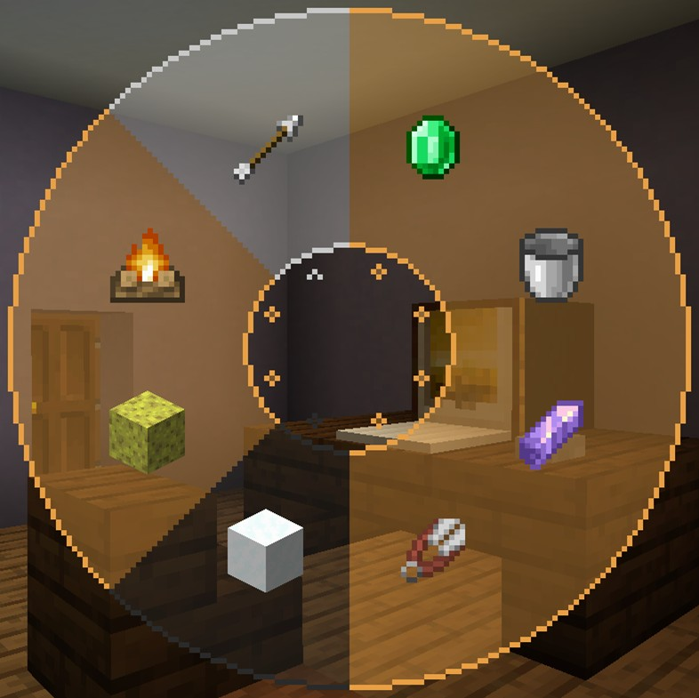
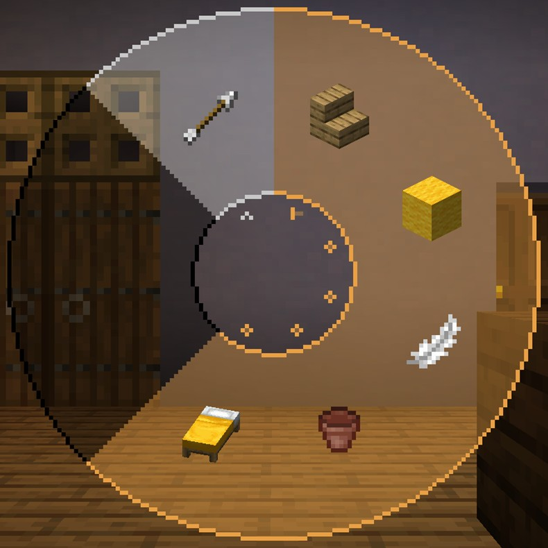
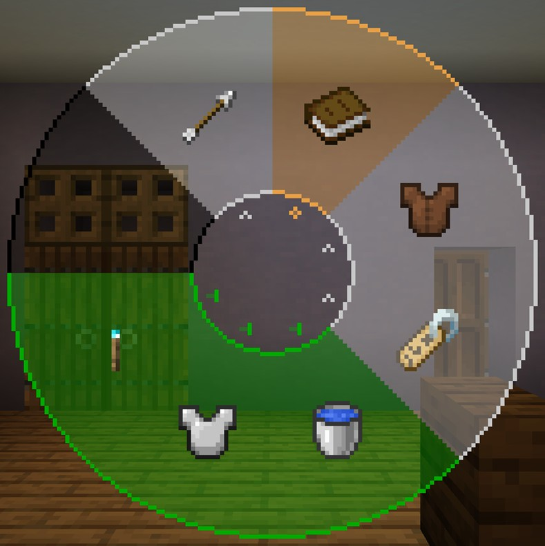

# SenkoSan（仙狐さん）
TVアニメ「世話やきキツネの仙狐さん」（とその原作）に登場するキャラクターを再現した、MinecraftのスキンMod「[Figura](https://www.curseforge.com/minecraft/mc-mods/figura)」向けスキン「SenkoSan（仙狐さん）」です。

**このREADMEには本来、大量の画像（約66MB）を添付していますが、通信量の軽減のため、必要最低限以外の画像は添付されおりません。全ての画像を確認したい方は[README（完全版）](./.github/workflows/README_full.md)をご覧ください。**

対応Figuraバージョン：[0.1.0-rc9](https://www.curseforge.com/minecraft/mc-mods/figura/files/4007916)



## 特徴
- 耳と尻尾のモデルが生えています。
  - 尻尾はプレイヤーの動きに合わせて揺れます。

  - 耳は**Xキー**、尻尾は**Zキー**で動かすことができます。

- 現在のHPや満腹度に応じてキャラクターの耳が垂れさがったり、表情が変わったりします。

- 時々瞬きします。
- [アクションホイール](#アクションホイール13)で様々なアニメーションを実行できます。

- [アクションホイール](#アクションホイール23)で座ることができます。
  - 座らないと実行できないアニメーションがあります。

- 就寝時は狐のような寝姿になります（第2話）。
  - 暗闇デバフを受けている時はまた別の寝姿（？）になります。

- 複数の衣装チェンジができます。どのような衣装があるかは[衣装カタログ](衣装一覧.md)をご覧ください。

- あなたの表示名をキャラクターの名前に変更できます。
  - 他のプレイヤーがこの名前を見えるようにするには、**他のプレイヤーもFiguraを導入し、あなたの信頼設定を十分上げる必要があります**。

- 水に触れると濡れてしまいます。
  - 水から上がると身震いして体に付いた水滴を飛ばします（[設定](#アバター設定について)でオフにできます）。

  - 尻尾は水にぬれるとしなびてしまいます（第5話）。

- 暗視が付与されていると頭上に狐火が出現します。
  - 濡れている場合は消えてしまいます。

- 特定のGUIが開いている間は眼鏡をかけます（第4話）。

- ウォーデンが付近いる（≒暗闇デバフを受けている）と、怯えて震えます。

  - 怯えている時は、エモートを拒否拒否するようになります。

## アクションホイール（1/3）
このアバターにはいくつかのアクションが用意されています。



### アクション1-1. お掃除
左クリックで箒掃除、右クリックで拭き掃除を行います。箒掃除にはレアパターンが存在します（レアパターンのアニメーションは第4話）。

### アクション1-2. 散髪
プレイヤーの髪を整えてくれます（第9話、スキンはプレイヤーのスキンになります）。少し切り過ぎますが...

### アクション1-3. きつねジャンプ
キツネのように雪に飛び込みます（第10話）。雪が十分に積もっており、十分なスペースが必要です。

### アクション1-4. ブルブル
水から上がった際のブルブルを手動で実行できます。

## アクションホイール（2/3）


### アクション2-1. おすわり
その場に座ります。もう一度アクション実行で立ち上がります。座っている時に動いたり、ジャンプしたり、スニークしたりすると自動で立ち上がります。

### アクション2-2. 尻尾モフモフ
プレイヤーが仙狐さんの尻尾をモフモフします（第1話、スキンはプレイヤーのスキンになります）。このアクションを実行するには先に座って下さい。ただし、変装服や防具表示状態でチェストプレートを着用している場合は実行できません。

### アクション2-3. 耳かき
膝枕でプレイヤーの耳を掃除してくれます（第2話、スキンはプレイヤーのスキンになります）。このアクションを実行するには先に座って下さい。

### アクション2-4. お茶
ほうじ茶を飲んで一息つきます（第6話）。このアクションを実行するには先に座って下さい。

### アクション2-5. マッサージ
プレイヤーの肩をほぐしてくれます（第7話、スキンはプレイヤーのスキンになります）。このアクションを実行するには先に座って下さい。

## アクションホイール（3/3）


### アクション3-1. 仙狐さんセリフ集
仙狐さんがアニメ内で使用していたフレーズを7つ選びました。クリックすると、チャットでセリフを発言します。**このセリフは通常のチャットと同様に送信され、Figuraを使用していないプレイヤーにも表示されます。**この機能を使用するにはFigura設定の**Chat Messages**が有効でないと機能しません。一度アクションホイールを閉じると、セリフ集を閉じることができます。

### アクション3-2. 衣装変更
アバターの衣装を変更します。スクロールで衣装を変更します。どんな衣装があるかは「[特徴](#特徴)」内の画像を確認して下さい。

### アクション3-3. 名前変更
プレイヤーの表示名を変更します。スクロールで表示名を選択します。ただし、他のプレイヤーが変更された名前を見るには、**そのプレイヤーもFiguraを導入し、あなたの信頼設定を十分上げる必要があります**。

### アクション3-4. 自動ブルブルの切り替え
[アバター設定](#アバター設定について)の``ConfigClass.AutoShake``の値を変更できます。ただし、 **アバターが再読み込みされる度に値が元に戻ります。** 永続的に値を変更する場合は、[設定ファイル](scripts/config.lua)から値を変更して下さい。

### アクション3-5. 防具の表示の切り替え
[アバター設定](#アバター設定について)の``ConfigClass.ShowArmor``の値を変更できます。ただし、 **アバターが再読み込みされる度に値が元に戻ります。** 永続的に値を変更する場合は、[設定ファイル](scripts/config.lua)から値を変更して下さい。

### アクション3-6. 一人称視点での狐火の表示の切り替え
[アバター設定](#アバター設定について)の``ConfigClass.FoxFireInFirstPerson``の値を変更できます。上を向いた際に、頭上の狐火が煩わしいと感じる場合はオフにして下さい。ただし、 **アバターが再読み込みされる度に値が元に戻ります。** 永続的に値を変更する場合は、[設定ファイル](scripts/config.lua)から値を変更して下さい。

## 推奨設定
### 信用度設定（Trust）
**Trusted**以上推奨

| 項目 | 推奨設定 | 備考 |
| - | - | - |
| Vanilla Model Change | **有効！！** | これが有効でないと、バニラのプレイヤーモデルが消えません！！ |
| Nameplate Change | 有効 | |
| Custom Player Heads | 有効 | |

### Figura設定（Settings）

| 項目 | 推奨設定 | 備考 |
| - | - | - |
| Chat customizations | "Script" または "Script + Badges" | |
| Entity customizations | "Script" または "Script + Badges" | |
| Tablist customizations | "Script" または "Script + Badges" | |
| Print Output | "Chat" | |
| First Person Hands | 無効 | |
| Chat Messages | 有効 | セリフ集からチャット発言するのに必要です。また、**安全のため、他のアバターに切り替える際は無効にして下さい。** |

### マインクラフト設定
| 項目 | 推奨設定 | 備考 |
| - | - | - |
| キー設定 | ZキーやXキーにキー割り当てを行わない | |
| 言語設定 | 日本語 | 日本語以外の言語では英語表示になります。また、英語への翻訳は正確でない可能性があります。 |

## アバター設定について
[設定ファイル（scripts/config.lua）](scripts/config.lua)を編集することで、一部のアバターの初期値を変更できます。
- 2022/10/12現在、Figuraの仕様上ゲーム内での設定を提供できません。
- 下記以外の場所を編集しないで下さい。また、不正な値を設定しないで下さい。不具合のもととなります。

```lua
ConfigClass.DefaultCostume = 1
ConfigClass.DefaultName = 3
ConfigClass.AutoShake = true
ConfigClass.ShowArmor = false
ConfigClass.FoxFireInFirstPerson = true
```

| 項目 | 説明 | 有効な値 | 初期値 |
| - | - | - | - |
| ``ConfigClass.DefaultCostume`` | アバター読み込み時に適用するコスチュームのIDです。詳しくは設定ファイル内の説明をご覧ください。 | ``integer`` 1 - 8 | 1 |
| ``ConfigClass.DefaultName`` | アバター読み込み時に適用するプレイヤーの表示名です。詳しくは設定ファイル内の説明をご覧ください。 | ``integer`` 1 - 3 | 3 |
| ``ConfigClass.AutoShake`` | 水から上がった際に自動で身震いするかどうかです。 | ``boolean`` | ``true`` |
| ``ConfigClass.ShowArmor`` | 防具を表示するどうかです。 | ``boolean`` | ``false`` |
| ``ConfigClass.FoxFireInFirstPerson`` | 一人称視点で狐火を表示するかどうかです。この設定に関わらず、三人称視点では条件を満たせば常に表示されます。 | ``boolean`` | ``true`` |

## 注意事項
- このアバターは[Figuraコミュニティー](https://discord.gg/ekHGHcH8Af)に寄せられたリクエストの延長線上のアバターです。
- このアバターを使用して発生した、いかなる損害の責任も負いかねます。
- 原作漫画を読むつもりはありません。
- 不具合がありましたら、[Issues](https://github.com/Gakuto1112/SenkoSan/issues)までご連絡下さい。

## リンク集
- [Figura（CurseForge）](https://www.curseforge.com/minecraft/mc-mods/figura)
- [Figura（Modrinth）](https://modrinth.com/mod/figura)
- [TVアニメ「世話やきキツネの仙狐さん」オフィシャルサイト](http://senkosan.com/)
- [Amazon.co.jp_ 世話やきキツネの仙狐さんを観る _ Prime Video](https://www.amazon.co.jp/gp/video/detail/B07QJG9NP7)