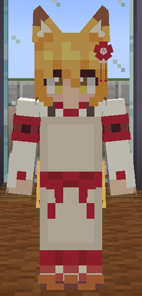
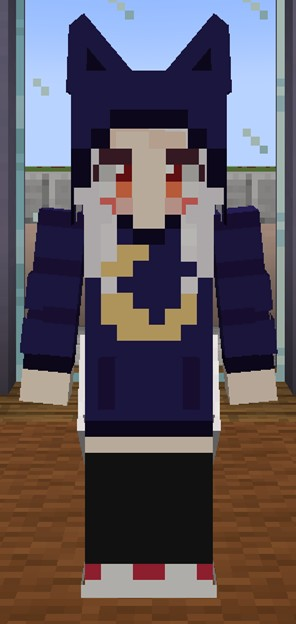
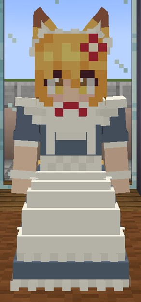
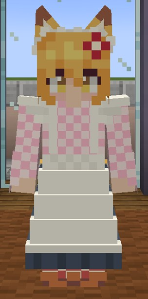
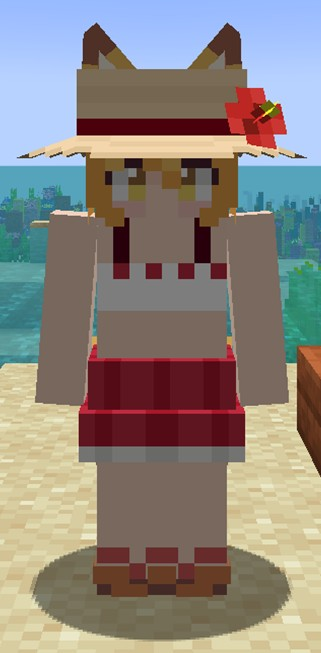
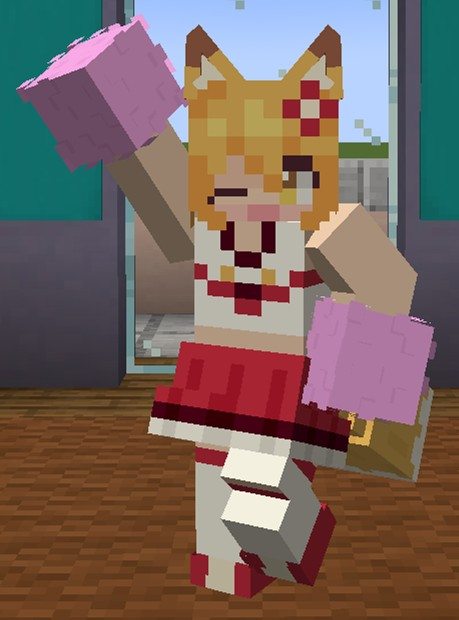
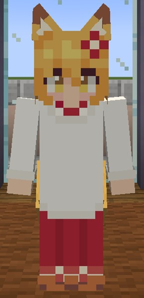
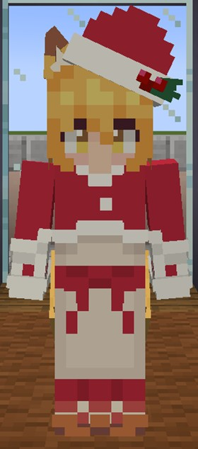

# 衣装一覧
キャラクターに着せられる衣装の一覧です。[アバター設定](../SenkoSan/README.md#アバター設定)から衣装を着せ替えられます。（一部の衣装の写真は古い場合があります。）

## いつもの服

## 寝巻き
第2話で登場した服です。

## 変装服
第3話で登場した服です。

## メイド服A
第6話で登場した服です。

## メイド服B
第6話で登場した、大正ロマン風のメイド服です。

## 水着
第8話で登場した服です。麦わら帽子は頭に防具を装備すると表示されます。ヘルメット（素材は問わない）を被ると麦わら帽子が表示されます（防具が表示されていると麦わら帽子は表示されません）。

## チアリーダーの服
なんか手元にアクリルスタンドがあったので、それを基に作りました。ポンポンは、アイテムを手に持っている場合やアニメーション再生中は非表示になります。（実際に画像のようなポーズはとれません）

## 清めの服
第8話で登場した服です。

## 割烹着
第11話で登場した服です。

## 浴衣
原作漫画（6巻表紙）で登場した服です。ヘルメット（素材は問わない）を被るとキツネのお面が表示されます（防具が表示されているとキツネのお面は表示されません）。

- 革の帽子
- チェーンのヘルメット
- 鉄のヘルメット

はアカギツネのお面、

- 金のヘルメット
- ダイヤモンドのヘルメット
- ネザライトのヘルメット

はホッキョクギツネのお面になります。

## ニット帽
原作漫画で中野君が仙狐さんにプレゼントしていたニット帽です。

## サンタさんの服
[作者様のTwitter](https://twitter.com/rimukoro/status/1342066683704352768)で投稿された画像を基に作成した服です。

